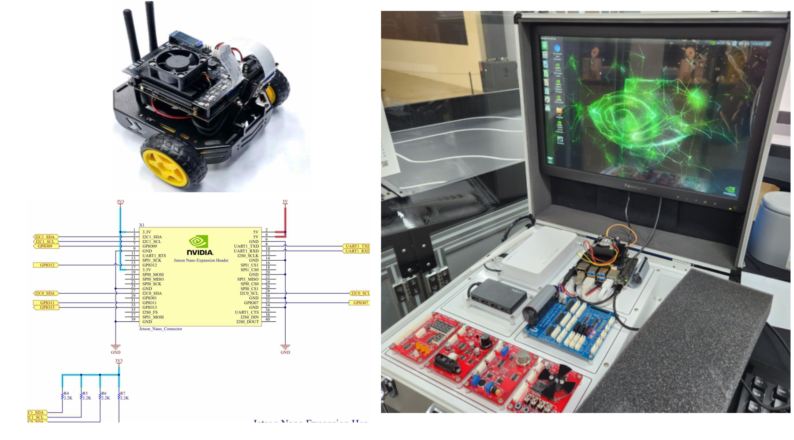
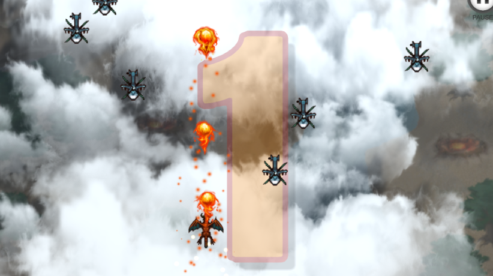
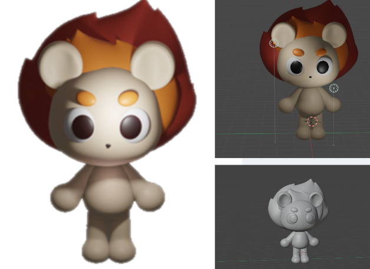
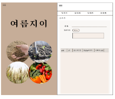
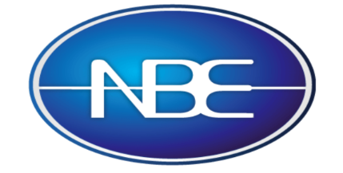

# Portfolio-Dev.Hwangje

## 나황제  

### [👨‍💻 Notion 포트폴리오](http://)

#### Web Developer 

**1996.03.26**  
email - na03266@naver.com  
github - http://github.com/NaHwangje  
blog - https://blog.naver.com/na03266

> 걸음을 멈추지 않는 개발자 개발자

> 빈 틈을 찾아서 채워나가는 개발자

> 더 효율적인 것을 찾고 더 편한 것을 위해 고민하는 개발자

# **목차**
1. [활동 요약](#활동-요약)  
  1-1. [교육/캠프] Nano Jetson 기반의 딥러닝 실습  
  1-2. [교육/캠프] 딥러닝 실습과 Java Framework 현장 실무  
  1-3. [교육/캠프] Unity(유니티) & Blender(블렌더)를 활용한 게임 콘텐츠 제작  
  1-4. [ICT멘토링] [이브와]어린이 안전강화! 현실기반 어린이 VR재난 대피 훈련  
  1-5. [ICT멘토링] [프로보노]여름지이  
  1-6. [교육/캠프] 진주 폴리텍대학 AI소프트웨어학과  
  
3. [프로젝트 요약](#프로젝트-요약)  
  2-1. [JetsonNano](#2023.9)  
  2-2. [Python](#python)  
  2-3. [Web](#web)  
  2-5. [ICT멘토링](#ICT멘토링)  

4. [프로젝트 상세](#프로젝트-상세)  
  3-1. [Python] [NBE 모니터링 시스템](#Python-NBE-모니터링-시스템)  
  3-2. [JetsonNano] [JetsonNano](#ios-lifem)  
  3-3. [Java] [블로그Demo](#블로그Demo)  
  3-5. [이브와] [어린이 안전 강화! 현실기반 어린이 VR재난 대피 훈련](#문서-어린이-안전-강화!-현실기반-어린이-VR재난-대피-훈련)  
  3-6. [프로보노] [여름지이](#기획-여름지이)  

  
   
# **활동 요약**
| 기간 | 프로젝트 명 | 내용     |
|:----|:---------|:--------|
| 2023.08.26 - 2023.09.24  | Nano Jetson 기반의 딥러닝 실습| Embedded 기초 및 딥러닝 기초, 자율주행 모듈 딥러닝   https://blog.naver.com/PostList.naver?blogId=na03266&from=postList&categoryNo=75|
| 2023.07.24 - 2023.08.04  | 파이썬, 딥러닝, JAVA Framework| 파이썬 딥러닝 실습과 Java기초, Java Framework(Maven) 현장 실무 https://www.kopo.ac.kr/jinju/content.do?menu=12979|
| 2023.07.10 - 2023.07.21  | Unity(유니티) & Blender(블렌더) | Unity(유니티) & Blender(블렌더)를 활용한 게임 콘텐츠 제작  https://www.kopo.ac.kr/jinju/board.do?menu=14508&mode=view&post=696877|
| 2023.05. -  |  어린이 안전 강화! 현실기반 어린이 VR재난 대피 훈련 | Unity와 Blender를 사용한 가상현실 게임   `이브와`에서 진행하는 ICT멘토링 공모전으로 ICT기업전문가와 대학생(멘티)가 팀을 이루어 수행하는 프로젝트     **참가주제** : [어린이 안전강화! 현실기반 어린이 VR재난 대피 훈련](#ios-옛다)   https://www.hanium.or.kr/portal/kibwa/businessOverview.do |
| 2023.03. - 2023.04. |  여름지이 | 농민과 노동자, 소비자의 소통을 보조하는 웹 앱   `프로보노`에서 진행하는 ICT멘토링 공모전으로 ICT기업전문가와 대학생(멘티)가 팀을 이루어 수행하는 프로젝트     **참가 주제** : [여름지이](#ios-옛다)   https://www.hanium.or.kr/portal/index.do |
| 2023.03   | 진주폴리텍 대학 AI소프트웨어과 | 웹 & 앱개발(Front-End), 서버/제어(Back-End), 빅데이터 관리, 딥러닝/인공지능 모델 학습, 기업 융합 프로젝트  https://www.kopo.ac.kr/jinju/content.do?menu=12979|

   

# **프로젝트 요약**

## python
| 기간 | 프로젝트 명 | 내용     |
|:----|:---------|:--------|
| 2023.08. - 진행중 | **[NBE 모니터링 시스템](#ios-옛다)**    *외주* | 485포트로 전송받는 값을 파싱해서 모니터링이 가능한 정보로 보여주는 프로그램    **PART** : 문서 및 API부분 (기여도 25%)   **LIST** : 전송 값 파싱 및 송수신, 회의록, 회고록 등의 문서    **STACK** : `python`|

   

## Web
| 기간 | 프로젝트 명 | 내용     |
|:----|:---------|:--------|
| 2023.07.10 - 2023.08.31 | **[SpringbootDemo](#)**    *개인프로젝트* | Gradle을 사용해서 블로그 기본 기능 구현, 디비 연결   **PART** : 개인진행   **LIST** : DB구조 설계 / 회원가입, 로그인 / OAuth2 / SpringSecurity / 게시판 글 작성, 수정, 삭제 기능    **STACK** : `Java`, `HTML`, `CSS`, `JavaScript`, `SpringBoot`, `Gradle`, `AWS`, `MySQL`, `RDB`, `EC2`, `Git-Action`, `OAuth2` |

   

## ICT멘토링
| 기간 | 프로젝트 명 | 내용     |
|:----|:---------|:--------|
| 2023.05. - 2023.07  | [어린이 안전 강화! 현실기반 어린이 VR재난 대피 훈련](#pm-어린이-안전강화-현실기반-어린이-vr재난-대피-훈련)   *이브와* | Unity와 Blender를 사용한 가상현실 게임   **PART** : 전체 문서 및 시나리오 관리 (기여도 50%)    **LIST** : 개발 보고서, SW개발 설계서, 시나리오 설계서, 회의록, 회고록   STACK : `Unity`, `Blender` |
| 2023.03. - 2023.04. | **[여름지이](#pm-여름지이)** *프로보노*| 농민과 노동자, 소비자의 소통을 보조하는 도농, 농직, 인력 중개플랫폼 등을 통합한 웹 앱   **PART** : 팀장    **LIST** : 아이디어 제안서, 개요서, 아키텍처 설계서, 발표자료   STACK : `HTML`, `CSS`, `JavaScript`, `JAVA` |
 

# **프로젝트 상세**
## [Python] NBE 모니터링 시스템

> 485포트로 전송 받은 값을 파싱하여 Python GUI로 모니터링이 편하도록 하는 프로그램
- Source : https://github.com/NaHwangje/NSENG  

- 첫 외주 프로젝트 입니다. rs232포트로 먼저 수신값을 확인하고 발신값과 수신 값이 일치하는지 확인하는 코드를 작성한 후에 각 값을 파싱하여 변수에 담아주고 GUI에 연결해주는 프로그램입니다. 현재 UI 디자인 작업이 진행중입니다. 

---

## [PM] 어린이 안전강화! 현실기반 어린이 VR재난 대피 훈련  

> 아이들을 위한 가상현실 3D 안전 교육 프로그램
- 개발중

- 어린이들이 다니고 있는 학교를 기반으로 다지인을 수정하며, 화재 사고 발생시 대처 법을 간접적으로 체험함으로써 실제상황 발생시 대처능력을 향상시켜 사고율을 낮추기를 기대하면서 준비한 프로젝트입니다.프로젝트 도중에 합류하여 유니티와 블랜더라는 툴을 처음으로 다루어 보기도 하고, 주로 시나리오, 처리해야할 문서등을 만졌지만, 직접 제작하는 과정을 정리하고 프로젝트 기간에 따른 진행도 및 보고서를 제작하게 되면서 유니티와 블렌더에 대한 이해가 깊어지게 된 경험이었습니다.

---
## [PM] 여름지이

> 도농, 농직, 인력중개플랫폼을 통합한 플랫폼 개설 
- 처음 진행했던 프로젝트이기도 하고 처음으로 팀장으로 활동했던 프로젝트입니다. 아이디어 회의를 하다가 농기계임대 플랫폼과 농촌 일자리 알선이라는 아이디어를 얻게 됨과 동시에 "우리도 네이버나 카카오처럼 통합한 서비스를 만들어보자!" 라는 생각으로 준비했던 프로젝트입니다. 끝까지 함께 하지는 못했지만, 아이디어를 세분화하고, 필요한 기능들을 구분하고 제안서까지 직접 만드는 과정에서 소프트웨어의 아이디어로 설계까지의 깊게 익히게 된 프로젝트 였습니다.
---

